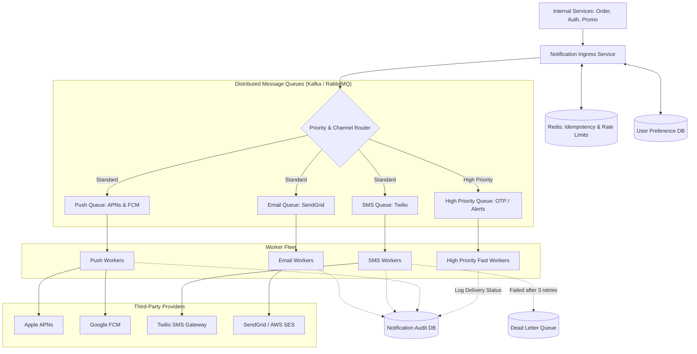

# Design a Notification System

## Step 1: Clarify Requirements

### Functional Requirements
- **Multi-Channel Delivery**: Support sending alerts across multiple delivery channels:
  - Mobile Push Notifications (Apple APNs for iOS, Firebase Cloud Messaging FCM for Android).
  - SMS Text Messages (Twilio / AWS SNS).
  - Email (SendGrid / AWS SES).
  - In-App Notifications (WebSockets / real-time activity feed).
- **User Notification Preferences**: Users can toggle opt-in/opt-out preferences per channel and notification category (e.g., enable SMS for order updates, disable marketing emails).
- **Template Management**: Support dynamic variable substitution into pre-registered templates (e.g., `"Hello {{name}}, your order #{{order_id}} has shipped"`).
- **Delivery Tracking**: Track status through a state machine: `QUEUED` $\rightarrow$ `SENT` $\rightarrow$ `DELIVERED` $\rightarrow$ `FAILED`.

### Non-Functional Requirements
- **Guaranteed Delivery (Zero Lost Notifications)**: High-priority transactional alerts (like OTP verification codes or payment confirmations) must never be dropped.
- **Soft Real-Time Latency**: High-priority alerts delivered in <5 seconds; marketing batches delivered within minutes.
- **Deduplication**: Prevent sending duplicate notifications to users caused by network retries or upstream service retries.
- **Rate Limiting & Spam Prevention**: Throttle maximum notifications per user to prevent notification fatigue.

---

## Step 2: Capacity Estimation

### Traffic & Volume
- **Daily Notifications**: 100 million notifications per day across all channels.
- **Average QPS**:
  $$\text{Average QPS} = \frac{100\text{M}}{86{,}400} \approx 1{,}160\text{ notifications/sec}$$
- **Peak Burst QPS**:
  Major breaking news or marketing campaigns can spike traffic by $10\times$:
  $$\text{Peak QPS} \approx 10{,}000\text{ to } 15{,}000\text{ notifications/sec}$$

### Storage Estimation (1-Year Audit Log)
- Each notification log record contains:
  - `notification_id` (UUID), `user_id`, `channel`, `status`, `template_id`, timestamps, error message.
  - Average record size: ~500 bytes.
- Total 1-year storage:
  $$100\text{M/day} \times 365 \times 500\text{ bytes} \approx 18.25\text{ TB}$$
  Suitable for an append-only distributed datastore (Cassandra / ClickHouse / DynamoDB).

---

## Step 3: API Design

### Send Notification Endpoint
- **Endpoint**: `POST /api/v1/notifications/send`
- **Headers**:
  - `Idempotency-Key`: `uuid_abc_123` (guarantees exactly-once processing)
- **Request Body**:
  ```json
  {
    "recipient_id": "usr_987654",
    "event_type": "ORDER_SHIPPED",
    "priority": "HIGH", // HIGH | LOW
    "channels": ["PUSH", "EMAIL"],
    "template_params": {
      "customer_name": "Sarah",
      "order_id": "ORD-44912",
      "tracking_link": "https://shipping.com/track/44912"
    }
  }
  ```
- **Response**: `HTTP 202 Accepted`
  ```json
  {
    "notification_id": "notif_uuid_001122",
    "status": "QUEUED",
    "created_at": "2026-09-03T12:00:00Z"
  }
  ```

---

## Step 4: Data Model & Schema

```sql
-- Table: user_preferences
CREATE TABLE user_preferences (
    user_id UUID NOT NULL,
    channel VARCHAR(16) NOT NULL, -- PUSH, SMS, EMAIL
    category VARCHAR(32) NOT NULL, -- TRANSACTIONAL, MARKETING, SECURITY
    is_enabled BOOLEAN DEFAULT TRUE,
    PRIMARY KEY (user_id, channel, category)
);

-- Table: notification_templates
CREATE TABLE notification_templates (
    template_id VARCHAR(64) PRIMARY KEY,
    channel VARCHAR(16) NOT NULL,
    subject_template TEXT,
    body_template TEXT NOT NULL,
    created_at TIMESTAMP WITH TIME ZONE DEFAULT NOW()
);

-- Table: notification_logs (Audit Trail & State Machine)
CREATE TABLE notification_logs (
    notification_id UUID PRIMARY KEY,
    user_id UUID NOT NULL,
    channel VARCHAR(16) NOT NULL,
    idempotency_key VARCHAR(128) UNIQUE,
    status VARCHAR(16) NOT NULL, -- QUEUED, SENT, DELIVERED, FAILED
    retry_count INT DEFAULT 0,
    created_at TIMESTAMP WITH TIME ZONE DEFAULT NOW(),
    updated_at TIMESTAMP WITH TIME ZONE DEFAULT NOW()
);
CREATE INDEX idx_logs_user_status ON notification_logs(user_id, created_at DESC);
```

---

## Step 5: High-Level Architecture



### End-to-End Delivery Flow:
1. **Ingress & Validation**: Upstream microservice calls the notification API with an `Idempotency-Key`.
2. **Deduplication Check**: Checks Redis for the idempotency key. If already processed within 24 hours, rejects duplicate request.
3. **Preference Filter**: Verifies that the user has not disabled this channel or category.
4. **Queue Enqueueing**: Renders template and pushes messages into channel-specific queues. High-priority alerts bypass standard queues.
5. **Worker Execution**: Dedicated worker pools pull messages, call external provider SDKs (APNs, FCM, Twilio), and record delivery status in the database.

---

## Step 6: Deep Dive: Reliability, Retries & Scalability

### 1. Guaranteed Delivery & Deduplication (Idempotency)
- Network timeouts between the caller and notification service can cause callers to retry already-sent messages.
- The Notification Ingress Service stores `idempotency_key` in Redis with `SET key val NX EX 86400`. If the key already exists, return the cached `notification_id` without re-queuing.

### 2. Handling Third-Party Provider Outages & Rate Limits
- External providers (Twilio, APNs, SendGrid) enforce strict external API rate limits and experience periodic transient outages.
- **Worker Isolation**: Each channel has its own independent queue and worker pool. If SendGrid experiences an outage, email queues back up, but SMS and Push notifications continue processing with zero degradation.
- **Exponential Backoff with Jitter**:
  When an external provider returns HTTP 429 (Rate Limit) or 503 (Unavailable), workers retry using truncated exponential backoff with full jitter:
  $$t_{\text{wait}} = \text{random}(0, \min(M, B \times 2^{\text{attempt}}))$$
- **Dead Letter Queue (DLQ)**: If a notification fails 3 consecutive retries, it is moved to a Dead Letter Queue for engineering investigation rather than blocking the worker pool.

### 3. Priority Queue Segregation
- Marketing promo blasts (e.g., 50 million black friday emails) must never delay a time-critical 2-Factor Authentication OTP SMS.
- OTPs and security alerts are routed to a dedicated `High Priority Queue` backed by pre-warmed auto-scaled workers with guaranteed sub-second processing.

### 4. Bulk User Fan-Out (Broadcast Campaigns)
- For broadcast notifications sent to 10 million users simultaneously:
  - The API does not create 10 million individual queue messages synchronously.
  - Instead, it enqueues a single **Campaign Job**.
  - Background batch workers read user IDs in chunks of 5,000 from the database, apply user preference filters, and publish small batches to channel queues asynchronously, smoothing out ingress load.
