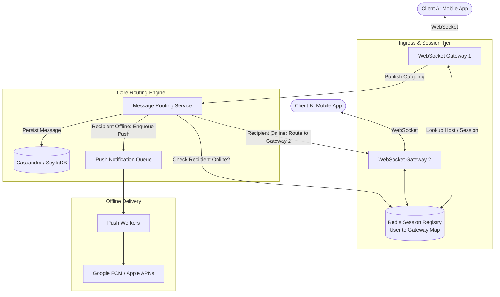

# Design a Real-Time Chat Application (WhatsApp / Slack)

## Step 1: Clarify Requirements

### Functional Requirements
- **1:1 Messaging**: Users can send real-time text and media messages to individual contacts.
- **Group Chat**: Users can create group conversations with up to 500 members.
- **Online Presence & Last Seen**: Real-time status indicators (Online, Offline, Last Seen at timestamp).
- **Delivery Receipts**: Message status tracking: `SENT` (single tick) $\rightarrow$ `DELIVERED` (double tick) $\rightarrow$ `READ` (blue ticks).
- **Offline Storage**: Messages sent to offline users are stored persistently and delivered immediately when the recipient reconnects.
- **Push Notification Fallback**: Trigger mobile push alerts (APNs/FCM) if a recipient is disconnected.

### Non-Functional Requirements
- **Ultra-Low Latency**: End-to-end message delivery under 100 ms for active online users.
- **High Availability**: 99.99% uptime for message routing and delivery.
- **Data Durability & Zero Loss**: Once acknowledged by the server, messages must never be lost.
- **Scalability**: Support hundreds of millions of concurrent open connections.

---

## Step 2: Capacity Estimation

### User & Traffic Scale
- **Daily Active Users (DAU)**: 500 million.
- **Messages per User per Day**: 40 messages on average.
- **Total Messages per Day**:
  $$500\text{M} \times 40 = 20\text{ billion messages/day}$$
- **Average Throughput (QPS)**:
  $$\text{Average QPS} = \frac{20\text{B}}{86{,}400} \approx 231{,}000\text{ messages/sec}$$
  $$\text{Peak QPS } (\times 2.5) \approx 580{,}000\text{ messages/sec}$$

### Storage Estimation (5 Years)
- Average message size: 200 bytes (text, timestamps, user IDs, metadata).
- Media files (images, audio, video) stored in Object Storage (S3); metadata in database.
- Daily text storage:
  $$20\text{B} \times 200\text{ bytes} \approx 4\text{ TB/day}$$
  5-Year Storage: $4\text{ TB} \times 365 \times 5 \approx 7.3\text{ PB}$.

### Bandwidth Estimation
- Ingress bandwidth:
  $$231{,}000\text{ msgs/sec} \times 200\text{ bytes} \approx 46.2\text{ MB/sec } (370\text{ Mbps})$$
- Egress bandwidth (accounting for group message fan-out $\times 3$ multiplier):
  $$\approx 140\text{ MB/sec } (1.1\text{ Gbps})$$

### Concurrent Connections
- At peak, 50% of DAU are connected simultaneously:
  $$500\text{M} \times 0.50 = 250\text{ million concurrent persistent connections}$$
- Each server holds ~50,000 to 100,000 WebSocket connections $\rightarrow$ requires a fleet of ~2,500 to 5,000 WebSocket gateway nodes.

---

## Step 3: Communication Protocol & API Design

### Protocol Choice: WebSockets
- **HTTP Polling / Long-Polling**: Creates excessive HTTP header overhead and exhausts ephemeral TCP ports at scale.
- **Server-Sent Events (SSE)**: Unidirectional only (server to client). Requires separate HTTP POST for client to server.
- **WebSockets (Selected)**: Full-duplex, bidirectional, persistent TCP connection with minimal 2-byte framing overhead after the initial HTTP upgrade handshake.

### WebSocket Message Payloads
Client to Server (Send Message):
```json
{
  "type": "MESSAGE_SEND",
  "client_msg_id": "uuid-client-12345",
  "chat_id": "chat_884920",
  "recipient_id": "usr_7721",
  "content": "Hey, are you free for a call?",
  "content_type": "TEXT"
}
```

Server to Client (Incoming Message Event):
```json
{
  "type": "MESSAGE_RECEIVE",
  "message_id": "msg_994827101",
  "chat_id": "chat_884920",
  "sender_id": "usr_1024",
  "content": "Hey, are you free for a call?",
  "timestamp": 1725364800000
}
```

Client to Server (Read Receipt):
```json
{
  "type": "MESSAGE_ACK",
  "message_id": "msg_994827101",
  "chat_id": "chat_884920",
  "status": "READ"
}
```

---

## Step 4: Data Model & Schema

Chat messages are write-heavy, append-only, and queried sequentially by time (`chat_id` + recent `timestamp`). Relational JOINs across billions of rows will not scale.

### Datastore: Distributed Wide-Column Store (Apache Cassandra / ScyllaDB)
- Keyspace partitioned horizontally by `chat_id`.
- Rows clustered and ordered by `message_id` (Snowflake ID) in descending order for rapid recent history retrieval.

```sql
-- Messages table (Partitioned by chat, sorted by time-ordered Snowflake ID)
CREATE TABLE chat_messages (
    chat_id UUID,
    message_id BIGINT, -- Snowflake ID (monotonically increasing time)
    sender_id UUID,
    content TEXT,
    media_url TEXT,
    status VARCHAR(16), -- SENT, DELIVERED, READ
    created_at TIMESTAMP,
    PRIMARY KEY ((chat_id), message_id)
) WITH CLUSTERING ORDER BY (message_id DESC);

-- User active conversations list
CREATE TABLE user_conversations (
    user_id UUID,
    last_activity TIMESTAMP,
    chat_id UUID,
    unread_count INT,
    PRIMARY KEY ((user_id), last_activity, chat_id)
) WITH CLUSTERING ORDER BY (last_activity DESC);
```

---

## Step 5: High-Level Architecture



### End-to-End Message Lifecycle:
1. **Connection Establishment**:
   - Client A opens a WebSocket connection to `WebSocket Gateway 1` via an L4 Load Balancer.
   - Gateway 1 authenticates the user and registers `user_A -> gateway_1_ip` in the **Redis Session Registry**.
2. **Sending a Message**:
   - Client A sends a `MESSAGE_SEND` frame over WebSocket.
   - Gateway 1 assigns a globally unique 64-bit Snowflake `message_id` and forwards it to the `Message Routing Service`.
3. **Storage & Lookup**:
   - `Message Routing Service` appends the message asynchronously to `Cassandra`.
   - Queries `Redis Session Registry` for Client B's current active gateway.
4. **Delivery**:
   - **Case 1 (Recipient Online)**: Redis returns `gateway_2_ip`. The router pushes the message to Gateway 2 via an internal message bus (e.g., Kafka / gRPC), and Gateway 2 pushes it down Client B's active WebSocket.
   - **Case 2 (Recipient Offline)**: Redis returns no active connection. The router enqueues an event to `Push Notification Queue`, triggering a mobile push alert via APNs/FCM. When Client B reconnects later, their client fetches unread messages since their last synchronized `message_id`.

---

## Step 6: Deep Dive & Distributed Bottlenecks

### 1. Connection Management & Gateway Scalability
- **TCP File Descriptor Limits**: By default, Linux systems enforce a 1,024 file descriptor limit. Production gateway nodes must configure `/etc/security/limits.conf` (`nofile 1000000`) and tune kernel TCP buffer parameters:
  ```bash
  sysctl -w net.ipv4.tcp_rmem="4096 87380 4194304"
  sysctl -w net.ipv4.tcp_wmem="4096 65536 4194304"
  ```
- **Connection Draining on Gateway Deploys**: When a gateway server restarts, 100,000 clients disconnect simultaneously. To prevent a **reconnection storm** (thundering herd), clients must implement exponential backoff with full jitter when reconnecting.

### 2. Presence System (Online / Offline Tracking)
- Checking presence by writing every connection ping to a database will destroy storage throughput.
- **Heartbeat & Ephemeral TTL in Redis**:
  - Connected clients send a heartbeat ping every 30 seconds.
  - Gateway updates Redis with a short key expiration:
    `SET presence:user_123 "ONLINE" EX 60`
  - If a user loses cell signal, the key automatically expires after 60 seconds without needing an explicit disconnect event.
- **Presence Fan-Out Optimization**:
  - Instead of broadcasting User A's presence changes to all 500 contacts immediately, only push presence updates to contacts who currently have an **open chat window** with User A.

### 3. Group Chat Fan-Out (Small vs. Large Groups)
- **Small Groups (<100 members)**:
  - **Fan-Out on Write**: When a message is sent to a group, the Message Router looks up all group members and copies/routes the message pointer to each member's personal inbox queue.
- **Large Groups (Channels with 10,000+ members)**:
  - Fan-out on write is too expensive ($10{,}000$ operations per message).
  - Use **Fan-Out on Read**: Group messages are stored in a single shared channel log. Clients pull new messages by maintaining a local pointer: `last_read_message_id`.
