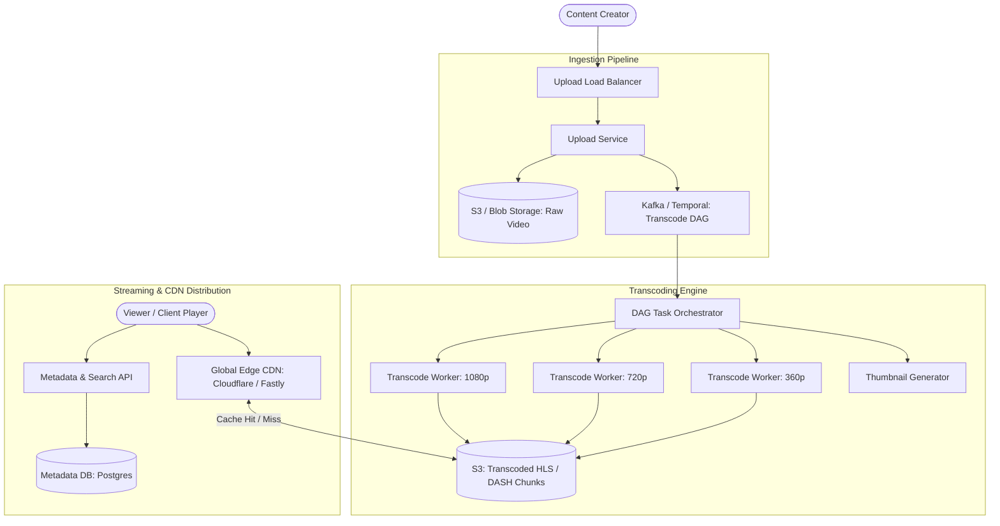

# Design a Video Streaming Platform (YouTube / Netflix)

## Step 1: Clarify Requirements

### Functional Requirements
- **Video Upload**: Content creators can upload videos up to several gigabytes in size.
- **Resumable Chunked Uploads**: Network interruptions during large uploads should not require restarting from the beginning.
- **Video Transcoding**: Transcode raw video into multiple resolutions (4K, 1080p, 720p, 480p, 360p) and formats (HLS, MPEG-DASH) for adaptive bitrate streaming.
- **Video Streaming**: Viewers can stream videos smoothly across varying device capabilities and dynamic network bandwidth.
- **Video Metadata & Search**: Users can search by title, view counts, creator profiles, and video descriptions.
- **View Count Tracking**: Track video view counts accurately with anti-fraud throttling.

### Non-Functional Requirements
- **High Availability**: 99.99% availability for playback; buffering or playback failures directly harm user retention.
- **Low Playback Latency**: Video playback must start within <1-2 seconds of clicking play.
- **Cost-Effective Scalability**: Egress bandwidth is the dominant cost; system must maximize Edge CDN caching efficiency.
- **Eventual Consistency**: A new upload taking 1-2 minutes to appear in search indexes is acceptable.

---

## Step 2: Capacity Estimation

### User & Upload Scale
- **Active Users**: 2 billion users worldwide.
- **Video Ingestion Rate**: 500 hours of video uploaded every minute.
- **Daily Upload Hours**:
  $$500\text{ hours/min} \times 60 \times 24 = 720{,}000\text{ hours of video/day}$$
- **Raw Storage Ingestion**:
  - Average raw video format: ~300 MB per minute of 1080p video ($18\text{ GB/hour}$).
  - Raw storage per day:
    $$720{,}000\text{ hours} \times 18\text{ GB} \approx 13\text{ Petabytes/day}$$
  - Post-transcoding compression (HEVC / AV1 / H.264 across resolutions) reduces footprint to ~3 GB per hour total:
    $$720{,}000 \times 3\text{ GB} \approx 2.16\text{ PB/day (Transcoded Storage)}$$

### Playback & Egress Bandwidth Scale
- **Daily Watch Time**: 1 billion hours of video viewed per day.
- **Average Playback Bitrate**: 3 Mbps (typical 720p/1080p stream).
- **Average Playback Egress Bandwidth**:
  $$\text{Concurrent Viewers} = \frac{1\text{B hours}}{24\text{ hours}} \approx 41.6\text{ million concurrent streams}$$
  $$\text{Total Egress Bandwidth} = 41.6\text{M} \times 3\text{ Mbps} \approx 125\text{ Tbps}$$
  *(Must be served 98%+ via distributed Edge CDNs to avoid saturating cloud datacenters).*

---

## Step 3: API Design

### 1. Initiate Resumable Upload
- **Endpoint**: `POST /api/v1/videos/upload-session`
- **Request**:
  ```json
  {
    "title": "Distributed Systems Deep Dive",
    "file_size_bytes": 1073741824, // 1 GB
    "file_format": "video/mp4"
  }
  ```
- **Response**: `HTTP 200 OK`
  ```json
  {
    "video_id": "vid_abc123",
    "upload_session_url": "https://upload.youtube.com/v1/resumable/session_token_xyz"
  }
  ```

### 2. Get Video Stream Manifest (Playback)
- **Endpoint**: `GET /api/v1/videos/{video_id}/master.m3u8`
- **Response**: `HTTP 200 OK` (Content-Type: `application/vnd.apple.mpegurl`)
  ```text
  #EXTM3U
  #EXT-X-VERSION:3
  #EXT-X-STREAM-INF:BANDWIDTH=5000000,RESOLUTION=1920x1080
  1080p/manifest.m3u8
  #EXT-X-STREAM-INF:BANDWIDTH=2500000,RESOLUTION=1280x720
  720p/manifest.m3u8
  #EXT-X-STREAM-INF:BANDWIDTH=800000,RESOLUTION=640x360
  360p/manifest.m3u8
  ```

---

## Step 4: Data Model & Schema

```sql
-- Table: videos (Relational: Postgres / Spanner)
CREATE TABLE videos (
    video_id UUID PRIMARY KEY,
    uploader_id UUID NOT NULL,
    title VARCHAR(255) NOT NULL,
    description TEXT,
    duration_seconds INT NOT NULL,
    status VARCHAR(32) NOT NULL, -- UPLOADING, PROCESSING, READY, FAILED
    hls_master_url TEXT,
    thumbnail_url TEXT,
    view_count BIGINT DEFAULT 0,
    created_at TIMESTAMP WITH TIME ZONE DEFAULT NOW()
);

-- Table: video_transcoding_tasks
CREATE TABLE video_transcoding_tasks (
    task_id UUID PRIMARY KEY,
    video_id UUID REFERENCES videos(video_id),
    resolution VARCHAR(16) NOT NULL, -- 1080p, 720p, 480p, 360p
    codec VARCHAR(16) NOT NULL,      -- H264, AV1, VP9
    status VARCHAR(16) NOT NULL,     -- PENDING, PROCESSING, COMPLETED
    output_path TEXT,
    updated_at TIMESTAMP WITH TIME ZONE DEFAULT NOW()
);
```

---

## Step 5: High-Level Architecture



### End-to-End Workflow:
1. **Resumable Upload**:
   - Creator client splits raw video into 10 MB chunks and uploads each chunk using HTTP `PUT` with byte-range headers (`Content-Range: bytes 0-10485759/1073741824`).
   - If network drops at chunk 50, upload resumes from chunk 51 without re-uploading chunks 1-50.
2. **DAG Transcoding Pipeline**:
   - Once all raw chunks are stored in `RawBucket`, `Upload Service` enqueues a job in `Kafka/Temporal`.
   - `Task Orchestrator` splits the video file into 10-second segments at GOP (Group of Pictures) keyframe boundaries.
   - Dispatches parallel transcode jobs across a fleet of GPU-accelerated workers (`ffmpeg`) to produce different resolutions (1080p, 720p, 480p) and formats.
   - Generates `.m3u8` playlist indexes and `.ts` chunk files and writes them to `TranscodedBucket`.
3. **Adaptive Bitrate Playback**:
   - Viewer client requests `master.m3u8` from `Edge CDN`.
   - Client inspects current device bandwidth: if fast Wi-Fi, it requests `1080p/chunk01.ts`. If bandwidth drops on mobile data, client seamlessly switches down to `480p/chunk02.ts` on the very next chunk with zero user buffering.

---

## Step 6: Deep Dive & Distributed Bottlenecks

### 1. Adaptive Bitrate Streaming (ABR): HLS vs. DASH
- **HLS (HTTP Live Streaming)**: Developed by Apple, standard across iOS/macOS and universally supported in modern browsers via Media Source Extensions (HLS.js).
- **MPEG-DASH**: Open international standard, widely used on Android, Smart TVs, and web.
- **The Magic of 10-Second Chunks**:
  - Transcoded videos are chopped into uniform 2 to 10-second `.ts` or fragmented MP4 (`fMP4`) segments.
  - Video manifest file lists sequential URLs for each segment.
  - Client player continuously estimates download throughput:
    $$\text{Throughput} = \frac{\text{Chunk Size (bits)}}{\text{Download Duration (sec)}}$$
  - Switches streams dynamically without requiring audio/video decoder reinitialization.

### 2. Multi-Tier CDN Caching & Cost Reduction
Serving 125 Tbps directly from cloud object storage (S3) would incur astronomical egress costs (~$0.08/GB).
- **80/20 Pareto Distribution**:
  - The top 20% of trending viral videos account for >80% of all views.
  - **Tier 1 (Edge CDN)**: Top viral videos cached at ISP point-of-presence (PoP) edge nodes closest to users.
  - **Tier 2 (Origin Shield / Regional Cache)**: Intermediate regional caching layer between Edge CDN and Cloud Object Store.
  - **Tier 3 (Cloud S3 Storage)**: Only long-tail unpopular videos with few views hit the origin S3 bucket.
  - Result: **98%+ CDN Cache Hit Ratio**, reducing origin egress costs by up to 50x.

### 3. Scalable Real-Time View Counting
Updating a single database row on every view (`UPDATE videos SET view_count = view_count + 1 WHERE video_id = :id`) causes severe row lock contention under 100,000 requests/second.
- **Asynchronous Aggregation with Redis & Kafka**:
  1. Playback client emits a view beacon after 30 seconds of continuous playback.
  2. Ingress servers append the event to Kafka.
  3. Stream workers buffer counts in Redis using atomic `INCRBY video:views:vid_123 1`.
  4. A scheduled flush worker batches updates every 10 seconds and writes the aggregated delta to PostgreSQL:
     ```sql
     UPDATE videos SET view_count = view_count + :batched_delta WHERE video_id = :vid;
     ```
