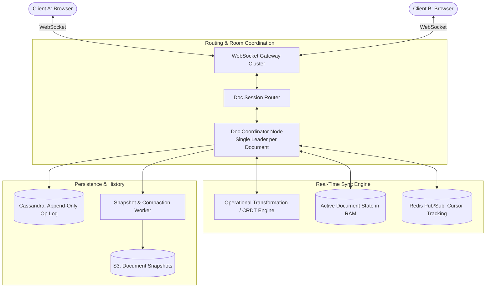

# Design Google Docs (Collaborative Real-Time Editor)

## Step 1: Clarify Requirements

### Functional Requirements
- **Real-Time Collaborative Editing**: Multiple users can edit the same document concurrently with changes rendered in near real time (<50 ms).
- **Character-Level Conflict Resolution**: Edits must never overwrite or delete concurrent changes made by collaborators at different or overlapping positions.
- **Cursor & Selection Awareness**: Real-time visualization of collaborators' cursor positions and text selections.
- **Offline Editing & Reconnection**: Users can continue making edits while disconnected; changes reconcile automatically upon reconnecting.
- **Version History & Audit**: Full audit trail of document revisions with ability to restore to previous points in time.

### Non-Functional Requirements
- **Low Latency**: Keystroke-to-screen round-trip latency under 100 ms for all participants.
- **High Consistency & Convergence**: All clients must converge to the exact same document state once all concurrent operations have been processed.
- **High Availability**: 99.99% uptime. Document editing must remain resilient against server instance crashes.

---

## Step 2: Capacity Estimation

### Traffic & Operations Scale
- **Daily Active Users (DAU)**: 10 million users.
- **Active Collaborative Documents**: 50,000 concurrent active collaborative sessions at peak.
- **Typing Rate**: Average active user types 5 keystrokes/second.
- **Concurrent Ingress Operation Rate**:
  $$50{,}000\text{ sessions} \times 2\text{ active typers} \times 5\text{ ops/sec} = 500{,}000\text{ operations/sec}$$

### Storage Estimation
- Total documents: 100 million documents.
- Average document text size: 100 KB text + 200 KB revision metadata $\approx$ 300 KB.
- Total document storage:
  $$100\text{M} \times 300\text{ KB} \approx 30\text{ TB}$$
- Operation log storage (1 year):
  - 500,000 ops/sec $\times 100$ bytes/op $\approx 50\text{ MB/sec } (1.57\text{ PB/year})$.
  - Stored in an append-only distributed log (Cassandra / ScyllaDB) and compacted into S3 snapshots periodically.

---

## Step 3: API & Protocol Design

### Protocol Choice: WebSockets
HTTP request/response creates intolerable overhead for character-by-character updates. A persistent full-duplex WebSocket connection per document session is mandatory.

### Real-Time Operation Payloads

1. **Client to Server (Operation Submission)**:
```json
{
  "type": "DOC_OP",
  "doc_id": "doc_xyz789",
  "client_version": 42,
  "op": {
    "action": "INSERT", // INSERT | DELETE
    "position": 15,
    "character": "H",
    "op_id": "usr_A_op_101"
  }
}
```

2. **Server to Client (Operation Broadcast)**:
```json
{
  "type": "DOC_BROADCAST",
  "doc_id": "doc_xyz789",
  "server_version": 43,
  "op": {
    "action": "INSERT",
    "position": 16, // Transformed index adjusted for concurrent edits
    "character": "H",
    "author_id": "usr_A"
  }
}
```

3. **Cursor Presence Broadcast**:
```json
{
  "type": "CURSOR_MOVE",
  "doc_id": "doc_xyz789",
  "user_id": "usr_B",
  "color": "#FF5733",
  "cursor_position": 84,
  "selection_range": [84, 92]
}
```

---

## Step 4: Data Model & Schema

```sql
-- Table: documents (Document metadata)
CREATE TABLE documents (
    doc_id UUID PRIMARY KEY,
    owner_id UUID NOT NULL,
    title VARCHAR(255) NOT NULL,
    current_version BIGINT NOT NULL DEFAULT 0,
    created_at TIMESTAMP WITH TIME ZONE DEFAULT NOW(),
    updated_at TIMESTAMP WITH TIME ZONE DEFAULT NOW()
);

-- Table: document_snapshots (Stored periodically in S3, indexed here)
CREATE TABLE document_snapshots (
    snapshot_id UUID PRIMARY KEY,
    doc_id UUID REFERENCES documents(doc_id),
    version BIGINT NOT NULL,
    s3_snapshot_url TEXT NOT NULL,
    created_at TIMESTAMP WITH TIME ZONE DEFAULT NOW()
);

-- Table: document_operations (Append-only operation log in Cassandra)
CREATE TABLE document_operations (
    doc_id UUID,
    version BIGINT,
    author_id UUID,
    op_type VARCHAR(16),
    op_payload TEXT,
    created_at TIMESTAMP,
    PRIMARY KEY ((doc_id), version)
) WITH CLUSTERING ORDER BY (version ASC);
```

---

## Step 5: High-Level Architecture



### End-to-End Collaborative Loop:
1. **Document Session Affinity**:
   - When users open Document `XYZ`, the `Doc Session Router` assigns all active editors of `XYZ` to the **same Document Coordinator Node** using consistent hashing or an in-memory cluster registry (ZooKeeper / etcd).
2. **Local Optimistic Execution**:
   - When User A types a character, Client A applies the insertion locally **immediately** (0 ms UI latency) and places the operation into a local unacknowledged buffer.
3. **Transmission & Transformation**:
   - Client A sends the operation to the Document Coordinator Node.
   - If User B concurrently edited the document at the same version, the **Operational Transformation (OT) Engine** transforms User A's operation against User B's operation to adjust character index offsets.
4. **Broadcast & Convergence**:
   - The coordinator assigns the next monotonic `server_version` (e.g., 43), appends it to the Cassandra operation log, and broadcasts the transformed operation to all other connected collaborators.

---

## Step 6: Deep Dive: Concurrency Resolution (OT vs. CRDT)

The fundamental challenge of collaborative editing is that two users can type at the same index simultaneously:
- Initial text: `"CAT"`
- User A inserts `'L'` at index 1 $\rightarrow$ `"CLAT"`
- User B simultaneously inserts `'H'` at index 2 $\rightarrow$ `"CAHT"`
Without transformation, when User B applies User A's edit, index 1 is now ambiguous, resulting in document divergence (`"CLHT"` vs `"CHLT"`).

### Comparison: Operational Transformation (OT) vs. CRDT

| Property | Operational Transformation (OT) | Conflict-free Replicated Data Types (CRDT) |
|---|---|---|
| **Used by** | Google Docs, Apache Wave | Figma, Apple Notes, Yjs, Automerge |
| **Architecture** | Centralized server required as global sequencer | Peer-to-peer or serverless mesh friendly |
| **Algorithm** | Transformation functions: $T(op_A, op_B) \rightarrow (op_A', op_B')$ | Globally unique fractional positional identifiers |
| **Memory Overhead** | **Very low**: plain characters + simple index offsets | **Higher**: each character requires a unique UUID / vector clock |
| **Network Complexity** | Requires strict ordered transport (WebSockets + single server) | Commutative operations; out-of-order delivery tolerated |

### Operational Transformation Deep Dive (Google Docs Model)
Given two concurrent operations $A$ and $B$ applied against base version $V$:
- The transformation function $T(A, B)$ produces $A'$ and $B'$ such that:
  $$\text{apply}(\text{apply}(V, A), B') = \text{apply}(\text{apply}(V, B), A')$$
- **Index Shift Example**:
  - User A: `Insert("X", index=3)`
  - User B: `Insert("Y", index=1)`
  - When User A's server processes User B's operation, it sees $1 < 3$. User A's insertion index must be shifted right by 1 position:
    $$A' = \text{Insert}("X", \text{index}=4)$$
  - Both documents now converge to the exact same text sequence.

### Compaction & Snapshots
- Replaying 100,000 raw operations each time a document is opened would take seconds.
- Every 100 operations (or every 5 minutes), the Document Coordinator takes an in-memory snapshot of the rendered document, writes it to S3, and records the `version` milestone.
- New clients open the document by fetching the latest S3 snapshot and replaying only the few deltas that occurred since that snapshot.
