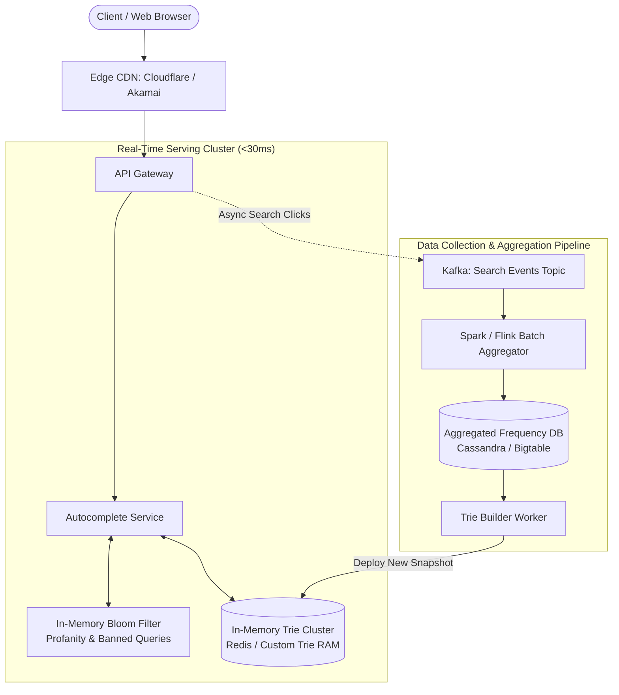

# Design Search Autocomplete (Typeahead Suggestion)

## Step 1: Clarify Requirements

### Functional Requirements
- **Prefix Matching**: Given a query prefix (e.g., `"sys"`), return the top 5 most relevant and popular completed search queries (e.g., `"system design"`, `"system design interview"`, `"system requirements"`).
- **Frequency-Based Ranking**: Suggestions must be ranked primarily by historical search popularity and frequency.
- **Real-Time Responsiveness**: Must return suggestions dynamically as the user types each keystroke.
- **Safety Filtering**: Inappropriate, hateful, or sensitive terms must be omitted from suggestions in real time.

### Non-Functional Requirements
- **Ultra-Low Latency**: End-to-end response time must be **<30 ms** (including network transfer) to keep up with human typing speed.
- **High Availability**: 99.99% availability. If autocomplete fails, search input must still function as a standard submission box.
- **Scalability**: Handle tens of thousands of requests per second during peak search traffic.
- **Fault Tolerance**: The serving infrastructure must tolerate instance failures without dropping query suggestions.

---

## Step 2: Capacity Estimation

### Traffic & QPS
- **Daily Searches**: 1 billion total searches per day.
- **Average Keystrokes per Search**: Users type ~4 characters before clicking a suggestion or pressing enter.
- **Total Autocomplete Requests**:
  $$1\text{B} \times 4 = 4\text{ billion requests/day}$$
- **Average QPS**:
  $$\text{Average QPS} = \frac{4\text{B}}{86{,}400} \approx 46{,}300\text{ requests/sec}$$
  $$\text{Peak QPS } (\times 2.5) \approx 115{,}000\text{ requests/sec}$$

### Storage Estimation (In-Memory Trie)
- Total unique historical search queries: 100 million distinct phrases.
- Average length per search query: 20 characters (20 bytes).
- Storing 100 million queries in raw form: $100\text{M} \times 20\text{ bytes} \approx 2\text{ GB}$.
- Memory overhead for Trie pointers, child node maps, and top-5 cached lists:
  $$\approx 2\text{ GB} \times 4 \approx 8\text{ to } 10\text{ GB RAM}$$
  Easily fits inside memory on a single modern server, and readily partitioned/replicated across a distributed Redis cluster for redundancy.

---

## Step 3: API Design

### Get Autocomplete Suggestions
- **Endpoint**: `GET /api/v1/search/autocomplete`
- **Query Parameters**:
  - `q`: String (query prefix, e.g., `"sys"`)
  - `limit`: Integer (number of suggestions, default 5, max 10)
- **Response**: `HTTP 200 OK`
  ```json
  {
    "prefix": "sys",
    "suggestions": [
      { "query": "system design", "score": 984021 },
      { "query": "system design interview", "score": 841200 },
      { "query": "system of equations", "score": 620194 },
      { "query": "system shock", "score": 412093 },
      { "query": "systematic review", "score": 381029 }
    ]
  }
  ```

---

## Step 4: Data Structure Design: The Trie

A standard relational database query using `LIKE 'sys%'` requires an expensive B-tree index range scan that cannot consistently satisfy <10 ms latency under 100,000 QPS.

### The Trie (Prefix Tree)
A Trie is an in-memory tree where each node represents a character. A path from the root to any node spells out a prefix:

```text
       (root)
       /    \
     s        a
    /          \
   y            m
  /              \
 s                a
 [Top 5:          [Top 5:
  system design,   amazon prime,
  system error...] amazon order...]
```

### Naive vs. Optimized Trie
- **Naive Approach**:
  1. Traverse down to the prefix node (e.g., root $\rightarrow$ 's' $\rightarrow$ 'y' $\rightarrow$ 's').
  2. Traverse *all* descendant branches of `'sys'` to locate all completed words.
  3. Sort all completed words by frequency and pick the top 5.
  - *Bottleneck*: Traversing all descendant subtrees can touch millions of leaf nodes in worst-case scenarios, taking hundreds of milliseconds.
- **Production Solution: Node-Level Top-$k$ Caching**:
  - Store the **top 5 most popular completed queries directly inside every node**:
  ```python
  class TrieNode:
      def __init__(self):
          self.children = {} # char -> TrieNode
          self.top_suggestions = [] # List of top 5 (query, frequency)
          self.is_terminal = False
  ```
  - Now, lookup complexity is strictly $O(L)$, where $L$ is the length of the input prefix (typically $\le 5$ characters).
  - Retrieving suggestions is an instantaneous $O(1)$ memory lookup once the prefix node is reached.

---

## Step 5: High-Level Architecture



### End-to-End Workflow:
1. **Real-Time Serving Path**:
   - Client sends keystroke event (e.g., `"sys"`) to Edge CDN.
   - If Edge CDN has cached the prefix, it returns immediately (<10 ms).
   - If CDN miss: `Autocomplete Service` checks the query against a fast in-memory **Bloom Filter** to block inappropriate suggestions.
   - Queries `In-Memory Trie Cluster` to fetch the pre-computed top-5 suggestions at node `"sys"`.
   - Returns response to client in <15 ms.
2. **Offline Data Pipeline**:
   - Every completed search query is logged asynchronously to Kafka.
   - An hourly/nightly **Apache Spark** batch job aggregates counts and applies exponential time decay so that seasonal trending topics (e.g., "World Cup", "Olympics") rise to the top.
   - `Trie Builder` builds a new Trie snapshot from aggregated frequencies, validates it, and hot-swaps it into the serving cluster without downtime.

---

## Step 6: Deep Dive & Distributed Bottlenecks

### 1. Client-Side Optimizations
Server load can be reduced by >50% before traffic ever reaches the backend:
- **Debouncing**: Wait 150-200 ms after the user stops typing before dispatching an HTTP network request. If the user types "apple" quickly, the browser skips sending requests for "a", "ap", and "app".
- **Browser Memory Caching**: Cache prefix responses in the client's local memory or `localStorage`. When the user types "app" and then backspaces back to "ap", the browser serves the suggestion immediately from cache without making a network call.

### 2. Trie Sharding & Partitioning
While an 8 GB Trie fits on a single machine, a single server cannot handle 115,000 peak QPS:
- **Range Partitioning**:
  - Shard Trie nodes by starting letters: Server 1 stores prefixes `[a - m]`, Server 2 stores `[n - z]`.
  - *Problem*: Highly unbalanced traffic (e.g., queries starting with `'s'`, `'c'`, or `'t'` are significantly more common than `'x'` or `'z'`).
- **Consistent Hashing by Prefix (Preferred)**:
  - Hash the first 2 characters of the prefix: $\text{hash}(p[0..1]) \pmod N$.
  - Distributes ingress traffic evenly across all Trie replica nodes.

### 3. Real-Time Trending Updates
- Batch updates via Spark ensure data quality and stability, but cannot respond to sudden breaking news events (e.g., an earthquake or celebrity death).
- **Hybrid Streaming Layer (Apache Flink)**:
  - Maintain a separate small real-time trending table in Redis for high-velocity queries observed in the last 15 minutes.
  - The Autocomplete Service queries the primary Trie snapshot and merges in any sudden spikes from the real-time trending buffer before returning.
