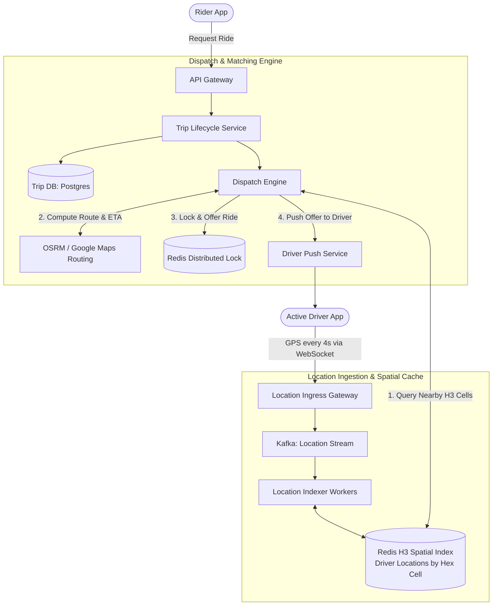

# Design a Ride-Sharing System (Uber / Lyft)

## Step 1: Clarify Requirements

### Functional Requirements
- **Real-Time Driver Tracking**: Active drivers continuously broadcast their GPS coordinates (latitude, longitude) every 4 seconds.
- **Rider Ride Request**: A passenger can request a ride from their current location, specify a destination, and receive an upfront fare estimate.
- **Driver-Rider Matching**: The dispatch system finds and dispatches the request to the optimal nearby available drivers within a search radius (e.g., 3-5 km).
- **Ride State Machine**: Complete trip lifecycle management: `REQUESTED` $\rightarrow$ `MATCHED` $\rightarrow$ `DRIVER_ARRIVED` $\rightarrow$ `IN_PROGRESS` $\rightarrow$ `COMPLETED` (or `CANCELLED`).
- **Dynamic Surge Pricing**: Automatically calculate fare multipliers based on real-time supply and demand imbalances in localized geographic zones.

### Non-Functional Requirements
- **Ultra-Low Latency Matching**: Match notification must reach the candidate driver within <3 seconds of request.
- **High Availability**: 99.99% uptime. System cannot afford downtime during peak commute hours.
- **Strong Consistency for Matching**: Exactly one driver can accept a given ride; two drivers must never be assigned to the same ride.
- **Scalable Geospatial Queries**: Handle hundreds of thousands of concurrent location updates per second with minimal lag.

---

## Step 2: Capacity Estimation

### Traffic & Scale
- **Daily Active Users (DAU)**: 20 million riders.
- **Active Concurrent Drivers**: 1 million active drivers on the road at peak.
- **Driver GPS Broadcast Rate**: Every 4 seconds.
- **Ingress Location Update QPS**:
  $$\text{Location Update QPS} = \frac{1{,}000{,}000\text{ drivers}}{4\text{ seconds}} = 250{,}000\text{ updates/sec}$$
- **Ride Requests**: 10 million completed rides per day.
  $$\text{Average Ride Request QPS} = \frac{10\text{M}}{86{,}400} \approx 115\text{ requests/sec (Peak: } 1{,}000\text{ QPS)}$$

### Memory Estimation (Active Location Index)
- Each driver GPS record:
  - `driver_id` (UUID): 16 bytes
  - `lat`, `long` (float64): 16 bytes
  - `timestamp`: 8 bytes
  - H3 Cell ID (uint64): 8 bytes
  - Redis memory overhead: ~40 bytes
  - Total per driver $\approx 88\text{ bytes}$.
- Total memory for 1 million active drivers:
  $$1{,}000{,}000 \times 88\text{ bytes} \approx 88\text{ MB}$$
  Extremely compact. Easily fits entirely in memory on a single Redis node, though replicated and clustered across regions for high availability.

---

## Step 3: API Design

### 1. Driver Location Heartbeat
- **Endpoint**: `POST /api/v1/drivers/location`
- **Request**:
  ```json
  {
    "driver_id": "drv_881920",
    "latitude": 37.774929,
    "longitude": -122.419418,
    "heading_degrees": 180,
    "status": "AVAILABLE" // AVAILABLE | ON_TRIP | OFFLINE
  }
  ```
- **Response**: `HTTP 200 OK`

### 2. Request a Ride
- **Endpoint**: `POST /api/v1/rides/request`
- **Request**:
  ```json
  {
    "rider_id": "rdr_10293",
    "pickup_lat": 37.7749,
    "pickup_long": -122.4194,
    "dropoff_lat": 37.7833,
    "dropoff_long": -122.4167,
    "ride_type": "STANDARD"
  }
  ```
- **Response**: `HTTP 202 Accepted`
  ```json
  {
    "trip_id": "trip_992144",
    "status": "SEARCHING_FOR_DRIVER",
    "estimated_fare": 18.50,
    "surge_multiplier": 1.2
  }
  ```

---

## Step 4: Data Model & Schema

```sql
-- Table: trips (Relational DB: PostgreSQL / CockroachDB for ACID guarantees)
CREATE TABLE trips (
    trip_id UUID PRIMARY KEY,
    rider_id UUID NOT NULL,
    driver_id UUID,
    status VARCHAR(24) NOT NULL, -- REQUESTED, MATCHED, IN_PROGRESS, COMPLETED, CANCELLED
    pickup_lat DOUBLE PRECISION NOT NULL,
    pickup_long DOUBLE PRECISION NOT NULL,
    dropoff_lat DOUBLE PRECISION NOT NULL,
    dropoff_long DOUBLE PRECISION NOT NULL,
    estimated_fare DECIMAL(10, 2) NOT NULL,
    actual_fare DECIMAL(10, 2),
    surge_multiplier DECIMAL(3, 2) DEFAULT 1.0,
    created_at TIMESTAMP WITH TIME ZONE DEFAULT NOW(),
    updated_at TIMESTAMP WITH TIME ZONE DEFAULT NOW()
);
CREATE INDEX idx_trips_rider ON trips(rider_id, created_at DESC);
CREATE INDEX idx_trips_driver ON trips(driver_id, created_at DESC);
```

---

## Step 5: High-Level Architecture



### End-to-End Matching Lifecycle:
1. **Location Tracking**:
   - 1 million drivers send location heartbeats every 4 seconds over persistent WebSockets to `Location Ingress Gateway`.
   - The worker converts GPS `(lat, long)` into an **Uber H3 Hexagonal Cell ID** (resolution 8, ~460m edge length) and updates the in-memory **Redis Geospatial Store**.
2. **Ride Request**:
   - Rider clicks "Request Ride" in the mobile app.
   - `Trip Lifecycle Service` generates a trip record in `TripDB` with status `REQUESTED`.
3. **Candidate Search**:
   - `Dispatch Engine` converts pickup `(lat, long)` into its primary H3 cell and identifies the 6 adjacent concentric hexagonal rings (k-ring search).
   - Retrieves all `AVAILABLE` drivers located within those cells from Redis in <5 ms.
4. **Ranking & Offer**:
   - Candidate drivers are ranked by real driving ETA (accounting for traffic and one-way streets via a routing engine).
   - The dispatch engine acquires a distributed lock on the top candidate driver (`SET lock:driver:123 trip_992 NX EX 15`) and pushes a 15-second ride offer to their phone.
5. **Acceptance or Fallback**:
   - If the driver accepts, the trip status updates to `MATCHED`.
   - If the driver declines or times out, the lock releases and the offer waterfalls to the next best candidate.

---

## Step 6: Deep Dive: Geospatial Indexing & Concurrency

### 1. Geospatial Indexing: Geohash vs. Uber H3 vs. QuadTrees
Standard relational database indexing (`WHERE lat BETWEEN ... AND long BETWEEN ...`) performs a 2D bounding-box scan that cannot handle 250,000 updates/sec.

| Geospatial Technology | Shape & Mechanism | Strengths | Weaknesses |
|---|---|---|---|
| **Geohash** | Rectangular bounding boxes encoded as base32 strings. | Simple string prefix matching. | **Edge Discontinuities**: Adjacent points across boundary borders can have completely different prefixes. |
| **Google S2** | Hierarchical square cells projected onto a sphere (Hilbert Curve). | Extremely fast bitwise operations. | Non-uniform edge lengths across coordinate projections. |
| **Uber H3 (Industry Standard)** | **Hexagonal Hierarchical Spatial Index**. Earth surface tiled into hexagons across 16 resolutions. | **Uniform Neighbors**: Every hexagon has exactly 6 neighbors with identical distance between centers. Ideal for radius searches. | Slightly higher math computation to convert coordinates to cell ID. |

### 2. Surge Pricing Architecture
Surge pricing balances local supply and demand dynamically:
- **Supply**: Count of `AVAILABLE` drivers in an H3 cell.
- **Demand**: Count of ride requests or app opens (intent to ride) in that H3 cell over the last 5 minutes.
- **Surge Multiplier Formula**:
  $$\text{Multiplier} = \max\left(1.0, f\left(\frac{\text{Demand}}{\text{Supply}}\right)\right)$$
- When demand outstrips supply, the multiplier increases, attracting more drivers to the area and rationing scarce ride capacity.

### 3. Preventing Race Conditions in Driver Matching
What happens if two riders request rides in the same neighborhood simultaneously, and both are matched to the same nearby driver?
- **Atomic State Transitions**:
  The driver's acceptance executes an atomic conditional update against the database:
  ```sql
  UPDATE trips
  SET status = 'MATCHED', driver_id = :driver_id, updated_at = NOW()
  WHERE trip_id = :trip_id AND status = 'REQUESTED';
  ```
  If the row was already updated by another concurrent assignment, zero rows are affected, and the application immediately retries with the next candidate.
